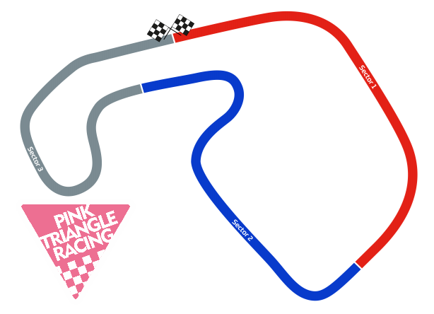

+++
date = '2025-08-09T14:30:19+01:00'
draft = false
title = '2025 Freetech 3 Sisters - 26th & 27th September' 
+++

Pink Triangle Racing is looking to make the trip up north to Wigan's home of motorsport, the [Three Sisters Circuit](https://threesisterscircuit.co.uk/).  This will be the team's first forray into racing at the circuit, so a fair amount of learning is to be had, and with a relaxed race calendar so far this season, a few cobwebs will likely need dusting off; mainly from the riders' muscles!!  Have a read through the page, and if you're interested in joining, do get in contact.

# Venue and Key Details
| Item | Notes |
|-----|----------|
| Date | Friday & Saturday 26th & 27th September 2025 |
| Venue | [Three Sisters Circuit](https://threesisterscircuit.co.uk/) |
| | [Google Maps Link](https://maps.app.goo.gl/TaM7MCtruqdseNsLA) |
| Venue Postcode | [WN4 8DD](https://threesisterscircuit.co.uk/more/contact)  |
|Championship | [Freetech Endurance](https://www.freetechendurance.com/) |
| **Friday 26th September** ||
| Event Format | Test day and 1hr Endurance Race |
| Bike | KTM RC 125 |
| **Saturday 27th September**||
| Event Format | 4hr Endurance Race |
| Bike | KTM RC 125 |
| Number of team riders | 3 riders|

# Get Involved
If a real endurance challenge is what you're after, this is a great chance to get involved.  Have a look through the [join us](join_us) page for further details about what you'll need, and feel free to get in [contact](contact) to get signed up.

# Team logistics
With key team members on [blood bikes](https://freewheelers.org.uk/) duty the proceeding week, it's most likely the bike will be arriving early on the Friday morning.  Some riders will be looking to camp at the circuit over the weekend. All riders joining the team will need to ensure they have arranged their own accommodation for the race meet.