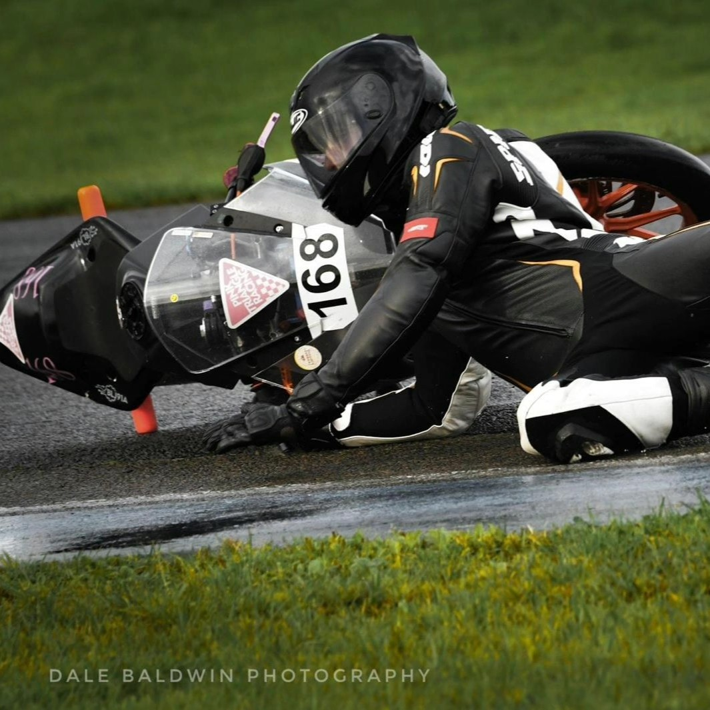
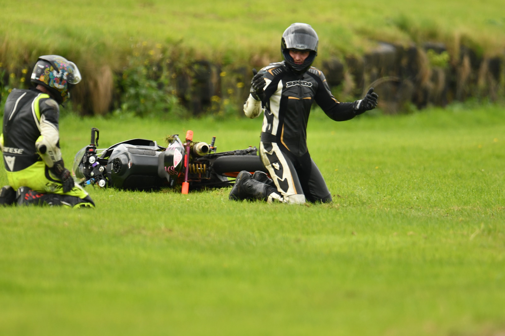
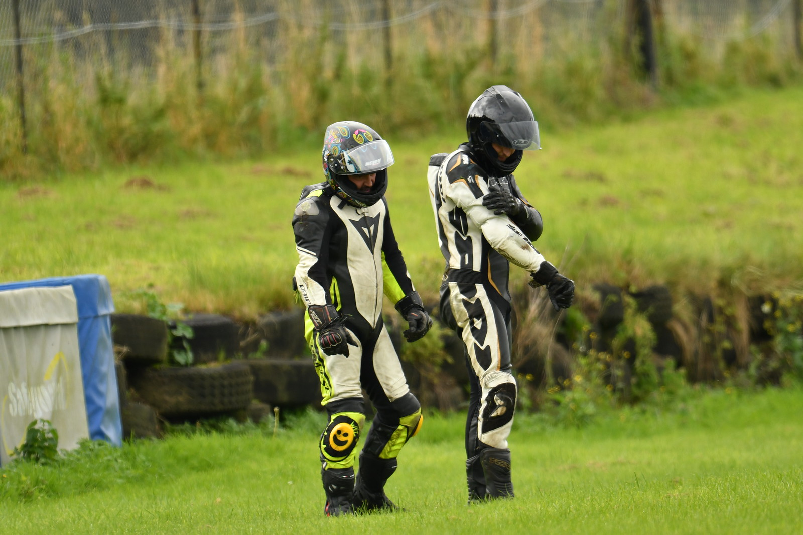
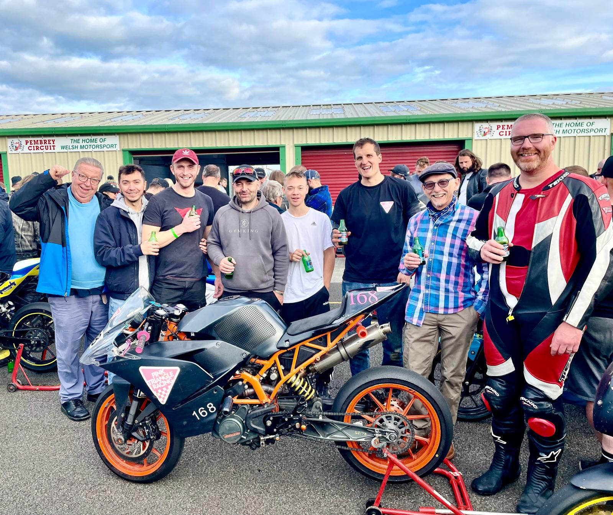

+++
date = '2025-06-28T10:01:09+01:00'
draft = false
title = 'FreeTech Round 5 - Pembrey'
+++

| Event Details |  |
|-----|----------|
| Date | Friday/Saturday 27th/28th September 2024 |
| Venue | [Pembrey Race Circuit](https://pembreycircuit.co.uk//) |
|Championship | [Freetech Endurance](https://www.freetechendurance.com/) |
|Results:||
| 168 Pink Triangle Racing | 42nd overall |
| 109 JP Racing | 44th overall |

Well, another great couple of days out on the bikes with a great track and great people, and for me, a stark reminder that motorsport in the UK is nothing without the dedication of the volunteer marshals. 
With the Plop Enduro round at Mallory park, on the same weekend, being cancelled at the last minute (due to lack of marshals) two more riders (Ricky, returning to Freetech after a bit of a break, and Pete, a first-time FreeTech-er) were brought on board to join the 109 JP Racing KTM with a last-minute race entry only going in on Thursday afternoon.

# Friday Testing
A great Friday test day was had, but with a bit of laziness about not bothering to change to wets on the first session seeing Scott (first-time racer and FreeTech-er) ditch the bike while on slicks just after the chequered flag. This gave us something to do to get some rear-sets swapped over and the bike ready for the rest of the day. Continual rider improvements were made throughout the day, and final gearings constantly being adjusted until we settled at what seemed a good spot.

# Saturday Race Day
Race day first practise, our laziness took hold again, but this time we refrained from sending a rider out on inappropriate tyres and basically sat out the first practise session. Pete and Adrian then went out and set not-too-great times of ~1m38s whilst on slicks on a damp and cold track. Pete improved on this massively with a 1m32.4s qualifying lap placing 109 JP Racing bike at a respectable 20th place on the grid. Lee followed in the second qualifying session and again posted a respectable 1m33.5s lap putting 168 Pink Triangle Racing bike 23rd on the grid.

The race start was stunning by Scott (168 Pink Triangle) whereas the 109 bike dropped a good few places to 41st which was recovered back up to 27th by the first rider change. With the riders of both KTMs being very similarly paced, places were swapped between the two teams as rider changes occurred and both teams hovered around 22nd and 23rd. The potential prospect of team orders was discussed (and mainly rejected) as 168 Pink Triangle bike was doing better in the StreetStock championship.
Lap 63 and a loose throttle grip brought 109 JP Racing into the pits for a bit of work. Quickly rectified, it was back out on track again, and Ricky (on 109) found himself directly behind Scott (168). 

Minutes later 109 was back into the pit garage, this time with grass all down its side… Had something further gone wrong with the throttle, had something else gone wrong? Before any damage could be assessed, 168 arrived alongside in the pit garage as well, also with grass down its side… Oh Christ, please don’t say the riders have taken each other off!!!

A mechanically-handy team meant people were naturally split working on the bikes and ~15min later, both were out again but now in 52nd and 56th place. Thankfully both riders were fine and after a quick medical check up were ready to continue with the day. It turns out a solo mistake, on the far right-hander, lead to a low-side crash, with the following bike having nowhere to go but follow into the grass.

So… a generally clean race from there, with consistent low 1m30s laps being put in, clean single-re-fuelling strategy being executed for both bikes and a busy bike runner throughout saw 168 Pink Triangle finishing 42nd overall with 109 JP Racing a lap behind in 44th position, having over-taken Ginger Bread Bikers only 5 laps from the end of the race.
Not the result that was available to the teams, given the pace of the riders, but then that’s endurance racing for you!!!

A great time had by all, and a reminder that massive thanks are due to the volunteer marshals for enabling the racing to go ahead!!!

