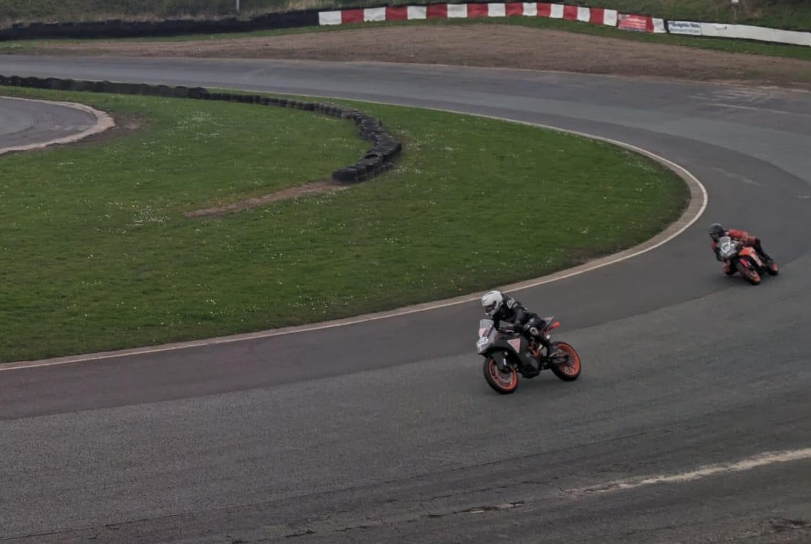
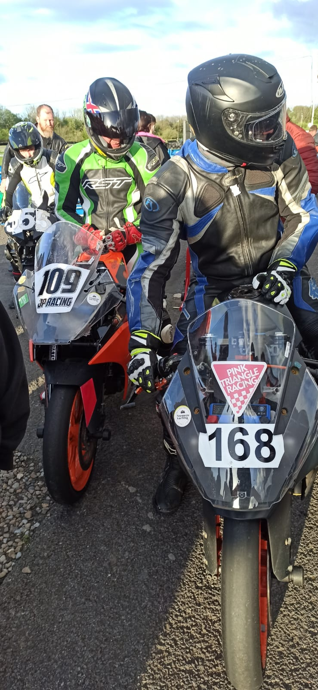
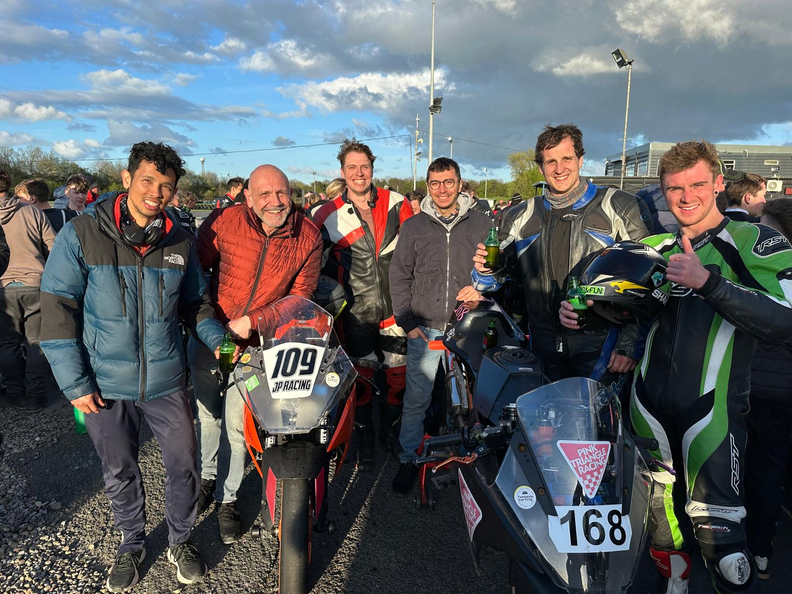

+++
date = '2025-07-01T03:20:46+01:00'
draft = false
title = 'FreeTech Round 1 - Teesside'
+++

| Event Details |  |
|-----|----------|
| Date | Friday/Saturday 12th/13th April 2024  |
| Venue | [Teesside Karting](https://teessidemotorsports.co.uk/) |
|Championship | [Freetech Endurance](https://www.freetechendurance.com/) |
|Results:||
| 168 PTR Sprints | Calogero - 3rd in clsass |
| 109 JPR Sprints | Adrian - 4th in class |
| 168 PTR Endurance | 34th overall |
| 109 JPR Endurance | 49th overall |

So, the first outing of the season, and the first time running two KTMs alongside each other. What’s the end result? A good time had by all, even if it’s resulted in a precautionary trip to A&E for one rider ☹.

# Friday test day
Test day on Friday went really well, and we made progress throughout the day, getting riders used to a new bike, race shift, a quick shifter and the track itself. Also making adjustments to sprockets to try and tune the final drive ratio.

# Saturday sprint races
Race day, and we had the two bikes out in the Freetech Sprint races; Calogero Lauricella out on 168 Pink Triangle Racing with Adrian Schmieder out on 109 JP Racing. 

Results came in as:
- Heat 1 -> Calogero 1st in class, Adrian 4th in class
- Heat 2 -> Calogero 3rd in class, Adrian 4th in class
- Final -> Calogero 3rd in class, Adrian 4th in class

Both with respectable fastest laps of around 1:24.

# Saturday endurance race
Onto the endurance race and Tommy Byatt, having squeezed a 1:23.4, had qualified Pink Triangle Racing into 15th overall, with Christian James having put 109 JP Racing at 26th with a 1:25.8 lap. Both decent efforts and putting us in good standing, though it was a shame not to make the most of this with the Le Mans start being abandoned.

## 109 JP Racing
Race start and unfortunately on the 2nd complete lap, Christian came off worst from a bust up into the hairpins after the long right-hander. Bike 109 down in the middle of the track, front fairing off, a bit of recovery back to the paddock and check over from Tom Geerah, our resident paramedic, and that’s Christian's race done for. Thankfully, repairs to the bike were shorter than those Christian may have to endure (sorry man), and we were able to get the bike back on the track and plodding around, but now basically dead last. 

Henry and Tom took turns keeping the bike upright and going round until Tommy took the last stint at the end of the race, which had taken our new Rider Manager Dan Grilo by surprise for being extended by some additional time. Tommy did a great final stint, setting the team’s fastest lap at 1:21.3, and brought the team back in at a respectable 49th overall, especially considering a 33min lap at the start while getting the bike back on track.

## 168 Pink Triangle Racing
Meanwhile, 168 Pink Triangle Racing had started with Tommy setting strong times of low 1min22s with Lee and Adrian in and around 1min28s bringing the team briefly to 11th overall but dropping a little to around 23rd until Tommy had the ignition momentarily cut out whilst banked over on the long right hander leading to him sliding out; thankfully just missing taking out Tom on the 109 bike; whom he’d just undertaken. A bit of a dust-down of the bike back in the paddock, a review and nothing seen to be wrong, and Tommy was out again, though with his confidence in the bike a little knocked and the team now running in 40th. From here the team continued well and was able to recover back up to 34th by the end of the race.

So a few photos in parc fermé, a pack-up in the paddock and then the long drive home. A great time had by all, some riders back to the championship after a bit of time away, some new riders introduced to the fun of Freetech Endurance, and some bike repairs to keep the manager busy before the next race at Whilton Mill where it’ll be super exciting to try out their new corner!!!

Until next time all and keep it shiny side up!