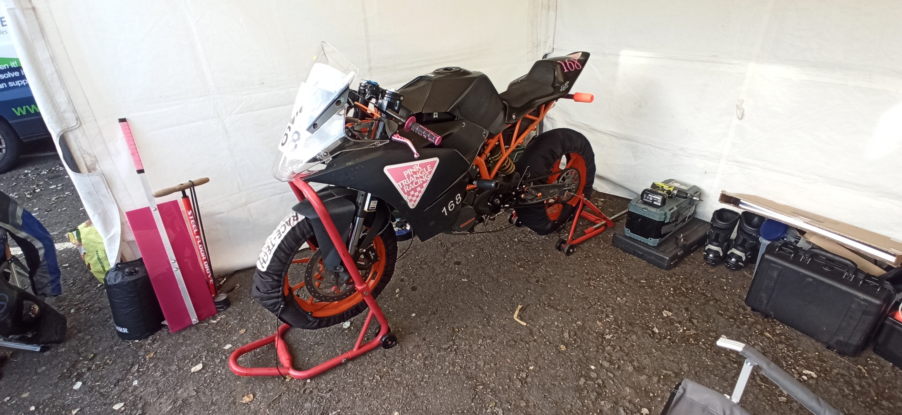
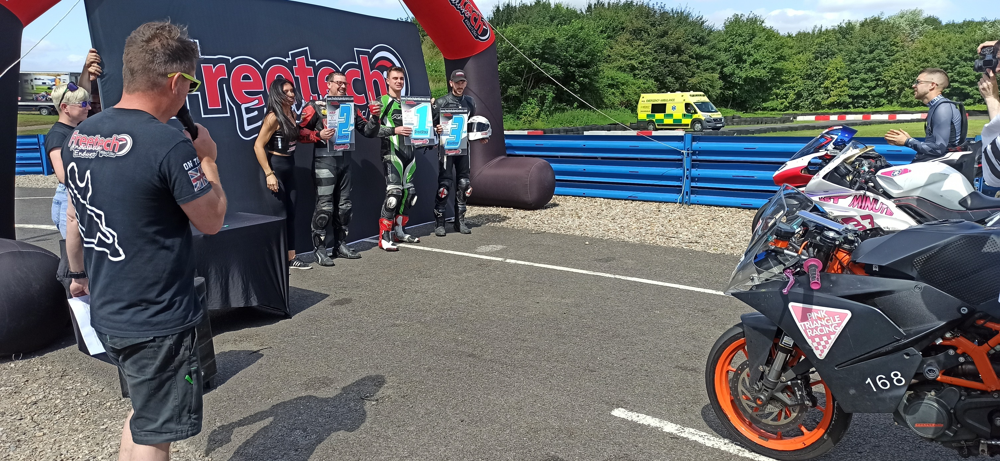
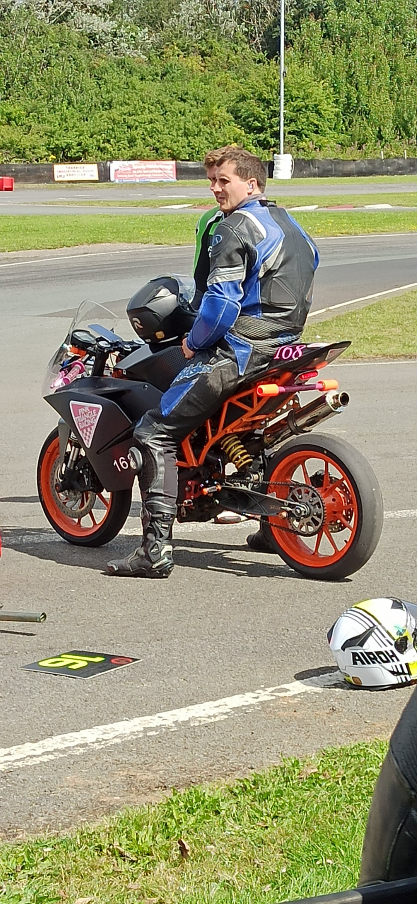
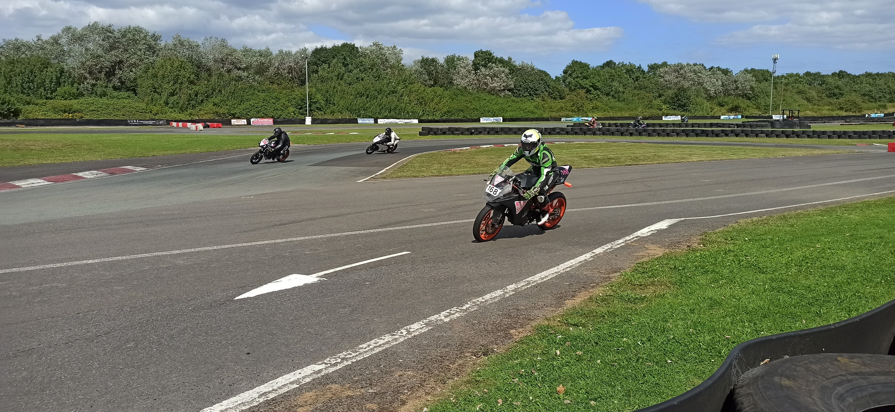
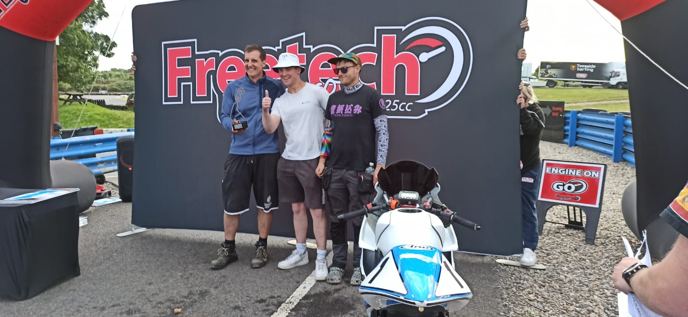

+++
date = '2025-06-28T10:17:52+01:00'
draft = true
title = 'Freetech Round 3 - Teesside'
+++

# Friday test day.
Tommy Byatt and Adrian Schmieder were available for the test day, to get some laps in and tune the gearing ratios. We started with the ratio we'd finished with earlier in the season at Round 1... Something must have changed as we ended up with a significantly longer ratio and that seemed to serve us well for the rest of the weekend. General feeling from the day was that things were going smoothly with Tommy putting in low 1:21s laps and Adrian getting fairly solid 1:25s.
Saturday morning and Jake Forster joined the team for the first time. Having race #teessidekarting quite a few times on pit bikes, this was his first outing with Freetech Endurance Streetstock Production Moto4. Great to have him get out and familiarise himself with the track and bike in the first practise session, and straight away posting 1:24s and 1:25s, it was clear he could ride a bike.

# Saturday Sprint races:
Tommy was flying throughout the sprint races. Qualifying put him in pole position for heat 1, which he finished in 2nd position. For Heat 2, we'd made a change to disengage a misbehaving quick shifter. Unfortunately, without any possible practise, the way we'd disconnected the quick shifter seemed to also affect the piggy-back ECU and the engine was misfiring... This meant Tommy had little power down the straights and he dropped to finish 5th; not great... he had lots to do in the final race to end on the podium... which is exactly what he did. A stunning ride and a thriller to the last lap when Tommy came home, not only 1st in class, but first overall winning the Freetech Sprints outright!!! What a ride!! Well done sir!!

# Team Endurance racing:
In between the sprint races, Jake (being the next fastest rider) was sent out in Qually 1 to see if he could get the team into the 2nd qualifying session. Posting a 1:22.04 placed the team 15th and crucially into Qually 2!! From here it was decided that Adrian would run Qually 2 session. Perhaps the fastest time wouldn't be possible, but as the team was into the 2nd qually session, the lowest we'd position would be 17th, and some warm-up track time before the race was deemed worthwhile. Adrian brought it home with a 1:24.02 lap putting the team 16th in Qually 2 session. We’re not totally sure what happened with the qualification times, but we ended up lining up 17th on the start line. Pretty happy with that, and with respectable times and consistency possible, it looked promising.

So, with Adrian starting for the 1st stint, the race was underway. Not the most competitive start as the team dropped from 17th to 24th, but with Tommy, Jake and Adrian setting consistent 1:20s, 1:23s and 1:25s respectively, the team was climbing back up through the field well; getting to 12th overall by lap 151. Unfortunately, and some learning to be had for future races, though the bike’s got an extended fuel tank, it wasn’t clear when we’d be close to running out of fuel, so an early fuel stop was incurred to prevent running out. It was then decided that, as class position wasn’t in jeopardy if we stopped for another splash-and-dash, a 2ndfuel stop was incurred; it being preferable to lose a little time with a longer refuelling stop, than loosing much more time if the bike needed recovering from the far side of the track.

All seemed to go well with no accidents or crashes, and despite a fatigued and broken front fairing bracket, the team kept the bike in 12th overall, but more importantly 2nd in the Streetstock class!!! What a result as we brought home some silverware!!! The first ever Pink Triangle Racing endurance Podium!!! WHAT A RESULT on a KTM RC125!!!
Thanks to the riders on the team: Jake for jumping on a totally new bike to him and proving he could ride, Tommy for some stunning lap times and posting the team’s fastest lap of 1:19.7 and Adrian for consistent 1:25s to keep the team progressing well.

A total shame that Rowrah’s had to be called off, but it gives us some more time to prepare the bike for Pembrey (the Bristolian team’s “home” track). Thanks to all the organisers and the whole paddock for being a great crowd….

Oh, also… amazing to see a new KTM RC125 in the mix… Do drop us a message… it’ll be great to discuss tactics to keep these GXSRs at bay!!!