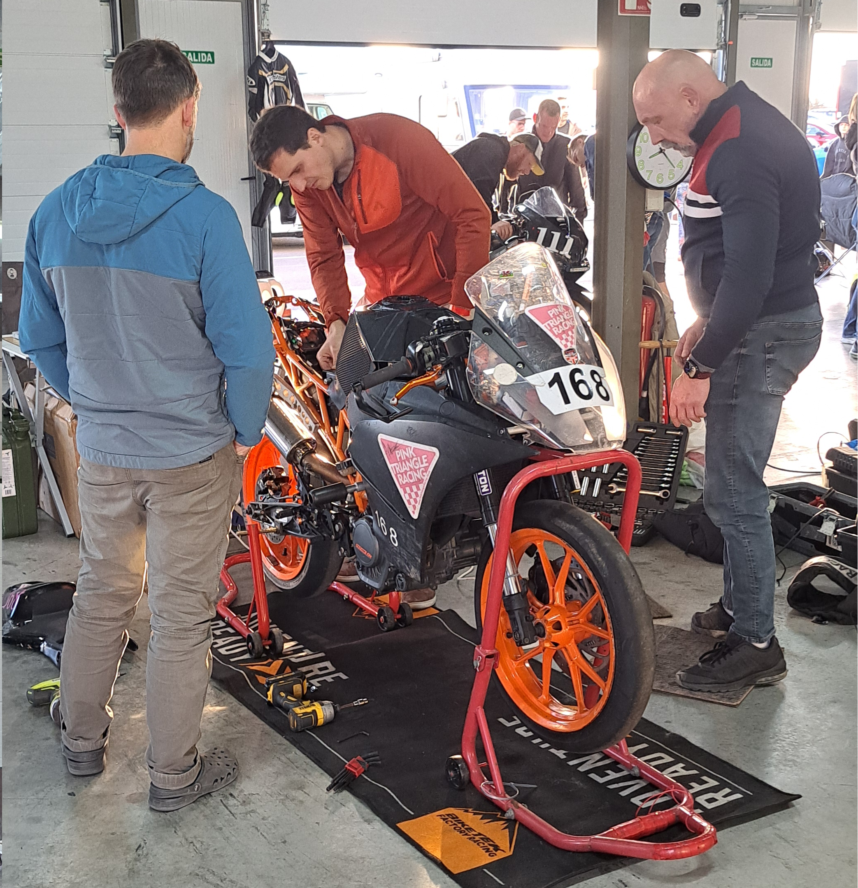
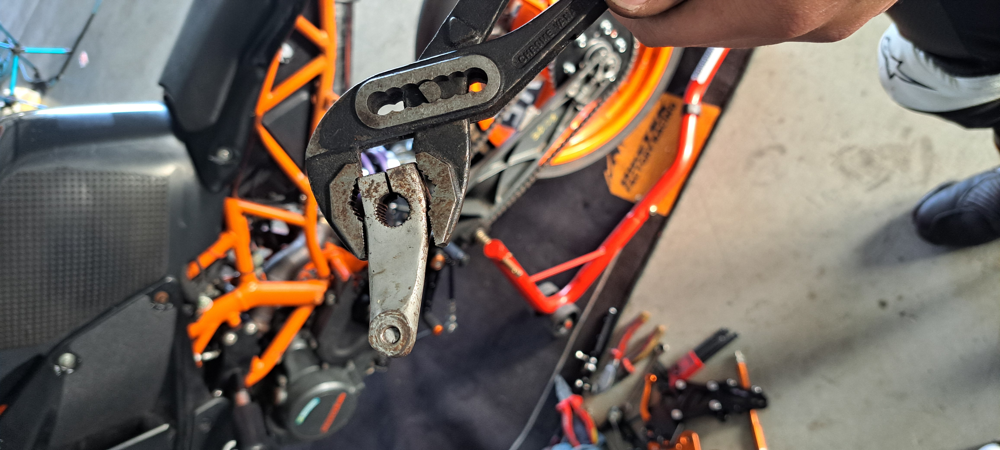
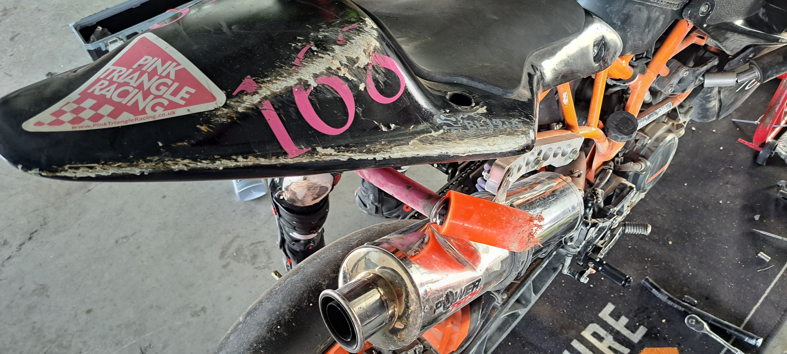
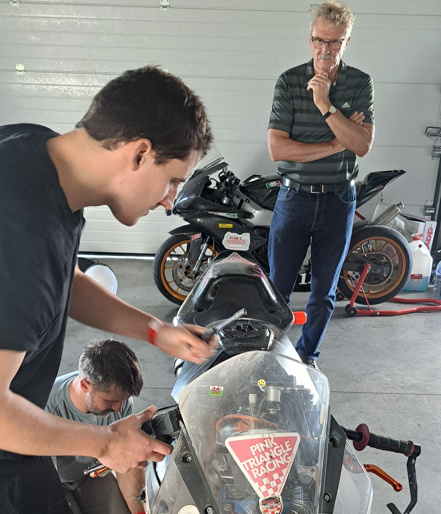
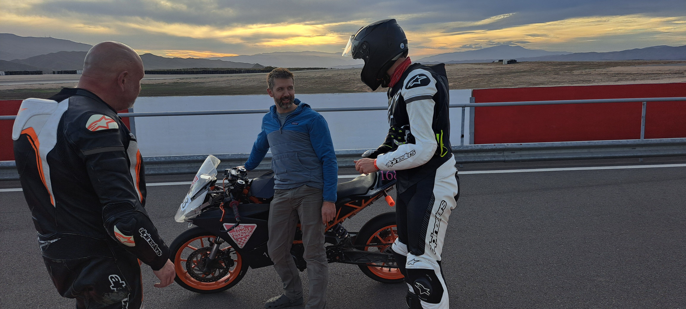
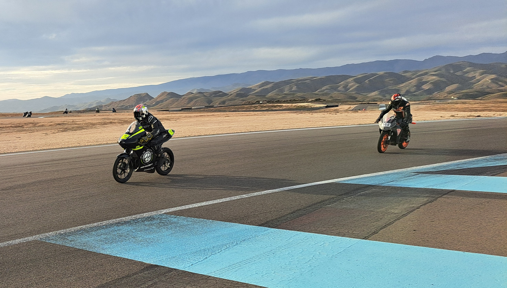
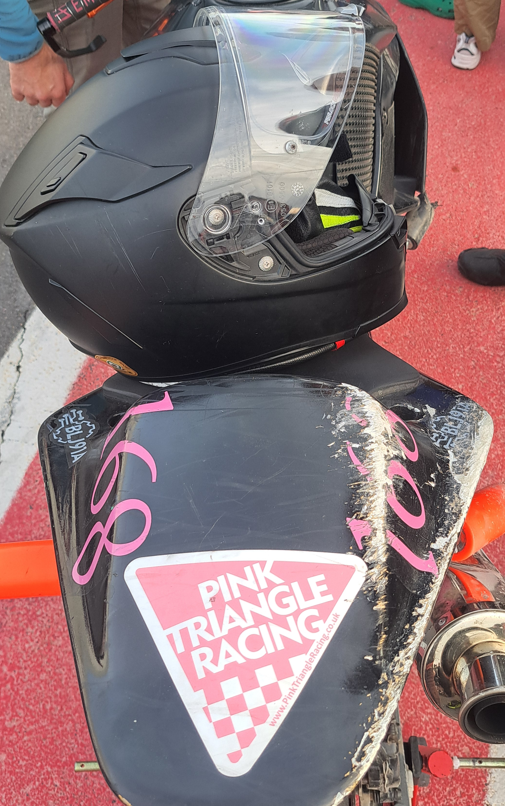

+++
date = '2025-11-09T16:40:15+01:00'
draft = false
title = 'Freetech Final Rounds - Andalucia, Spain'
weight = 30
+++

| Event Details |  |
|-----|----------|
| Date | Friday/Saturday 7th/8th November 2025  |
| Venue | [Andalucia Circuit](https://andaluciacircuit.com/) |
|Championship | [Freetech Endurance](https://www.freetechendurance.com/) |
|Results:||
| Friday 2hr Endurance | 10th in Class, 33rd overall |
| Saturday 8hr Endurance | 5th in Class, 14th overall |

# Race Preparations
A last-minute career change left Pink Triangle Racing one rider short for the Spanish season finale, but fortune smiled and Simon stepped in to join Henry and Adrian for one final dose of motorcycle mayhem in the Spanish sunshine. With the team complete, spirits were high as everyone arrived at the circuit on Thursday afternoon. Once access to the garages was finally granted, stillages were unloaded in record time, and the team secured a prime spot for the weekend ahead. With setup complete, the riders retreated to their accommodation for some well-earned rest before two days of hard racing.

# Friday - Testing, Tuning, and a Few Surprises

Friday testing began promisingly. A fresh engine re-map delivered smoother power and noticeable extra horsepower—huge thanks to [JHS Racing](https://www.jhsracing.co.uk/) for squeezing in a last-minute job before the bike had to be shipped to Spain.

But motorsport has its sense of humour. On Simon’s very first outing, the gear-linkage ball-joint bolt finally gave up to fatigue and snapped, ending Simon's session almost immediately.  Not the best welcome to the team for Simon, but far better to happen in testing than in a race. One lost session later, the bike was patched up and Simon was back out, quickly finding pace.

The rest of the day ran smoothly. All riders improved their lap times, gearing was tweaked a couple of times, and the bike behaved itself. Unfortunately, Simon—having taken his time in the paddock and missing Superpole 1— ended up, in Superpole 2, sliding the bike into the gravel at the end of the fastest section of the circuit.

As the team waited to see where he’d qualified, they instead saw him return to the garage on the recovery truck… just as the afternoon's final sprint race set off, minutes before the 2-hour endurance was due to begin. The clock was ticking.

# Friday - 2-Hour Endurance: The Big Repair & The Big Push
A frantic but brilliant team effort followed.

- Simon took charge of foot pegs,
- Adrian dove into clip-ons,
- Henry kept tools flowing like a well-oiled pit lane quartermaster,
- And the entire effort was overseen by the team’s honorary VIP: Dad.

Despite missing the Le Mans start, Simon roared out of pit lane only 30 seconds after the green flag—still on the lead lap and determined to claw back positions. The fight was on.



Mercifully, the race proved uneventful. The team pushed consistently, making up six places to finish 33rd overall and 10th in class. Not the dream result, but a massive achievement given the pre-race crash and repairs. As the sun set, photos were snapped, parts were re-aligned, and more substantial fixes were made in preparation for Saturday’s 8-hour marathon.

# Saturday - The 8-Hour Endurance: Strategy, Consistency, and Zero Drama

Saturday began with another “character-building” start: the bike sat in neutral as the Le Mans run commenced, leaving the team dead last yet again. But fate evened things out— a cold-tyres incident caught a few riders out on lap one, causing a red flag and bringing everyone straight back to the pits. A reset for all.



When racing resumed, Pink Triangle Racing settled into a near-perfect rhythm. Rider changes were slick and clean throughout the day, thanks in huge part to Dan, who excelled in his role as planner and rider manager. His careful timing calculations squeezed out precious minutes and avoided an extra rider swap—gaining the team a whole extra lap by the chequered flag.

Fuel strategy was equally on point. Friday’s race provided solid consumption data, and with ongoing calculations throughout the race, the team completed the full 8-hours with only two refuelling stops—a huge strategic win.

On track, pace was strong and stable. Simon clocked the team’s fastest lap of the weekend with a 2:26.9, and for eight full hours the bike didn’t miss a beat. No crashes, no mechanical drama—just smooth, disciplined endurance racing.

At the flag, Pink Triangle Racing secured an excellent 14th overall and 5th in class, capping off an immensely satisfying day for everyone involved.

# Wrapping Up

From last-minute rider changes to late evening repairs, from strategic fuel calculations to the joy of two drama-free endurance runs, the weekend delivered everything endurance racing promises. Huge thanks go out to the event organisers, the teams in the paddock, and everyone who supported the trip.

With the Spanish finale now behind them, Pink Triangle Racing is already looking forward to the 2026 season. See you all out on track next year!

