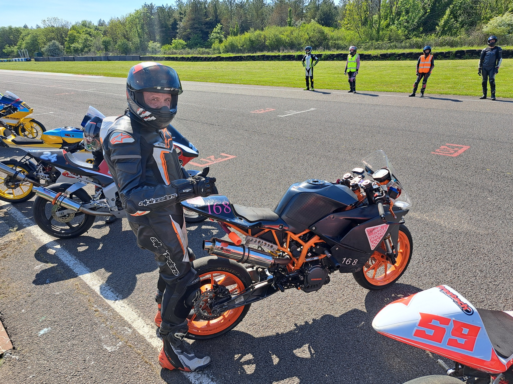
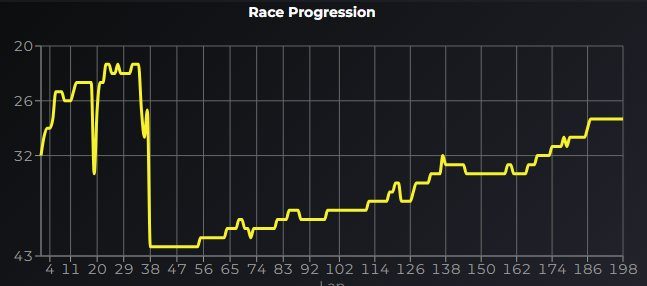
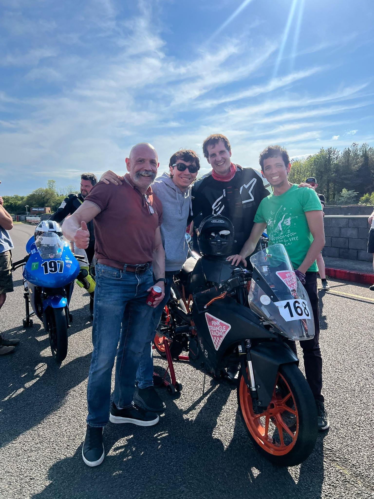

+++
date = '2025-06-28T09:48:15+01:00'
draft = false
title = 'Freetech Round 2 - Pembrey'
+++

| Event Details |  |
|-----|----------|
| Date | Friday/Saturday 9th/10th May 2025  |
| Venue | [Pembrey Race Circuit](https://pembreycircuit.co.uk//) |
|Championship | [Freetech Endurance](https://www.freetechendurance.com/) |
|Results:||
| Friday 1hr Endurance | 30th overall |
| Saturday 6hr Endurance | 28th overall |

We’re back! Pink Triangle Racing rejoined the season at Rounds 2 & 3 at Pembrey after missing out on what sounded like a brilliant opener at Darley Moor. Gutted not to make it — especially as none of us have raced there before — but such is life.

With the bike prepped and ready (new engine fitted, which had been sat on the bench all last season), we rolled into Pembrey with slightly longer gearing than our last setup. The plan was to shorten it through the Friday test if needed, but the setup felt spot on.

# Friday Test Day and Round 2

Smooth sailing — no dramas, no mechanical gremlins, and no spills. Henry, in only his second outing with the team and first time at Pembrey, got valuable laps in and continued adapting to race-shift. Lee and Adrian, a little more familiar with the circuit, were still refining lines — especially the ever-tricky Brooklands Hairpin.
In the race, Lee started strong from 32nd on the grid and the team brought it up to 30th by the flag. Solid progress! Henry shaved his times down from ~1:50s to 1:42s, Lee found his rhythm with consistent 1:31s and 1:32s, and Adrian was stuck in the 1:35s — still battling Brooklands Haripin.
# Saturday – Round 3
Early morning track walk chat with some of the juniors proved golden — Adrian dropped 2 seconds straight off the bat in warm-up! Starting P30 again, Lee fired the team up to P24 by the end of stint one. Adrian carried the momentum, pushing the team to P22 — until throttle issues struck. Loads of slack, no full throttle, and a long pit stop followed. Enter: the humble cable tie.

An 18-minute lap cost us dearly, dropping us to 42nd. But from there, it was a steady and rewarding climb back. Henry dropped into the 1:39s, Adrian broke into the 1:31s, and Lee hit a 1:29. We finished 28th overall, 10th in class — another two-place gain on our start. 

Had it not been for the throttle issue (costing roughly 10 laps), we’d have likely finished around 22nd overall and possible 6th in class. But reliability’s part of the game, and it’s on the fix-it list.
Most importantly — no crashes, no repairs, just solid racing, and a lot of laughs. Bring on the next round. See you all there!

