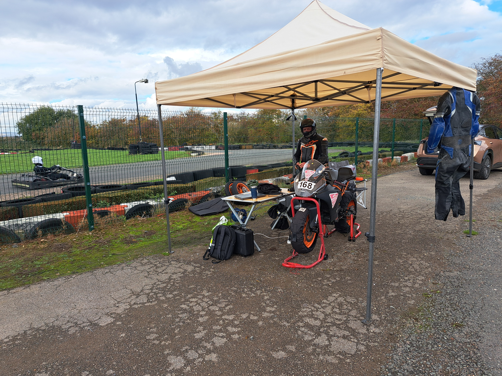
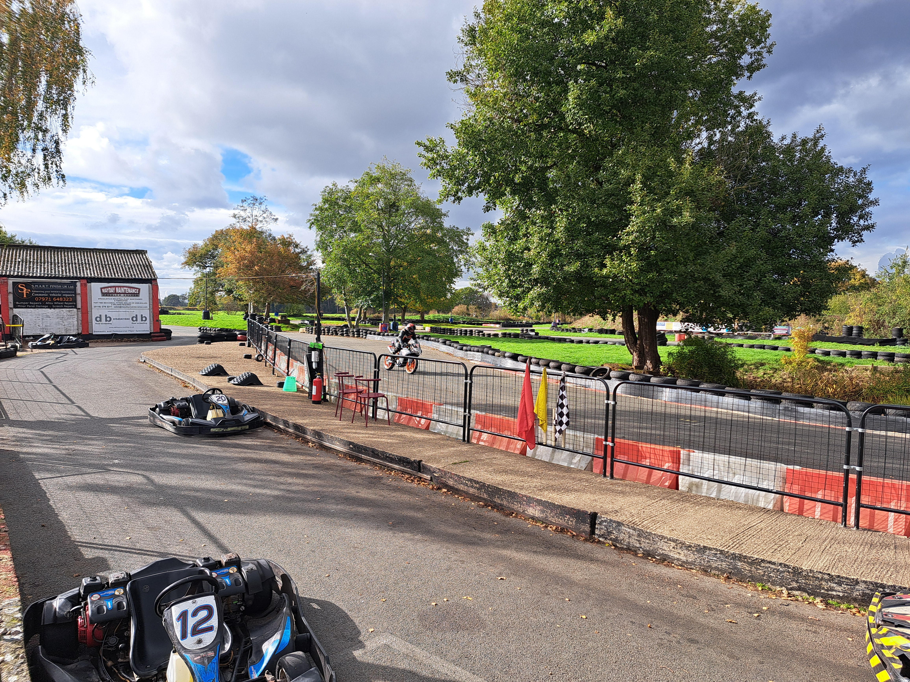

+++
date = '2025-10-25T17:37:15+01:00'
draft = false
title = 'Stretton Karting Test Day'
weight = 20
+++

| Event Details |  |
|-----|----------|
| Date | Wednesday 22nd October 2025 |
| Venue | [Stretton Circuit](https://strettoncircuit.co.uk/) |
|Championship | N/A |
|Results:| N/A |

# Bike shakedown required
Well, with the team soon to travel out to Spain for the Freetech season finale the bike has been pulled out of storage, dusted down and reviewed.  The team's racing activites have turned out to be fairly minimal over the season, and hence the bike hadn't been used since the [2nd round of the Freetech championship](/race_reports/2025/freetech_rnd2_pembrey/) back in May 2025.  As such, it was decided to take a sneaky test day to:
- Test the bike after servicing and repairs have been completed.
- Give the riders a bit of practise, not having ridden on track for the last 5 months.

Simon, a new rider to the team for the upcoming race at [Andalucia Circuit](https://andaluciacircuit.com/), suggested a trip to Stretton Karting Circuit was worthwhile as, during the week, they welcome bikes to run their own testing, in between karting sessions.  What a great idea to allow riders to use the track when it's not otherwise occupied.  So, bike preparations complete, following a last-minute engine swap, and the team arrives at Stretton.

# Riding conditions
Thankfully the Weather Gods were kind and provided a calm, dry and sunny day with temperatures in the mid teens.  Pretty much perfect motorbike racing conditions, and absolutely stunning for what could be expected in the middle of October.  The track is tight and technical and took a while for the two riders to get used to, and with no other bikes at the track that day, when out, the team had the whole circuit to themselves to mess about on.  With ample track time, and being able to run simulated Freetech 30min stints,  a great day was had.

# Findings from the day's testing
- The engine map has some holes in it
    - The KTM RC125 runs with a [RapidBike Evo](https://www.rapidbike.com/en/) piggy-back ECU which is advertised to have a closed-loop auto-tune feature.  This doesn't seem to be working ideally, and the bike started the day spluttering when pulling out of the corners.
    - A bit of tinkering, and reverting back to "older" settings seemed to make things better, but still not ideal.
    - A session with a local dyno tuner has been booked in.  Hopefully the team will be reaping the benefits once out in Spain.
- General mechanicals were good:
    - There were no break-downs during the day.  Everything seemed to work well.
- The riders were glad to have had a day back at the track:
    - Further familiarisation with the bike and acclimatisation to race-shift were valuable outcomes.

# On to Spain
So, following the shakedown, the bike is ready for its Dyno tune - watch out paddock; we'll be flying past with all the power that's to be extracted from the mighty KTM engine!!!  Following that, it's loading everything up in preparations for the bike being transported down to Spain.  Do keep an eye on the [Race Reports](/race_reports/2025/) section of the website to remain updated with how things progress. 
