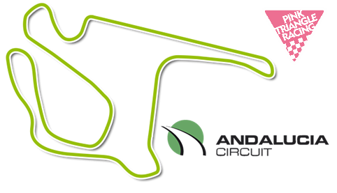
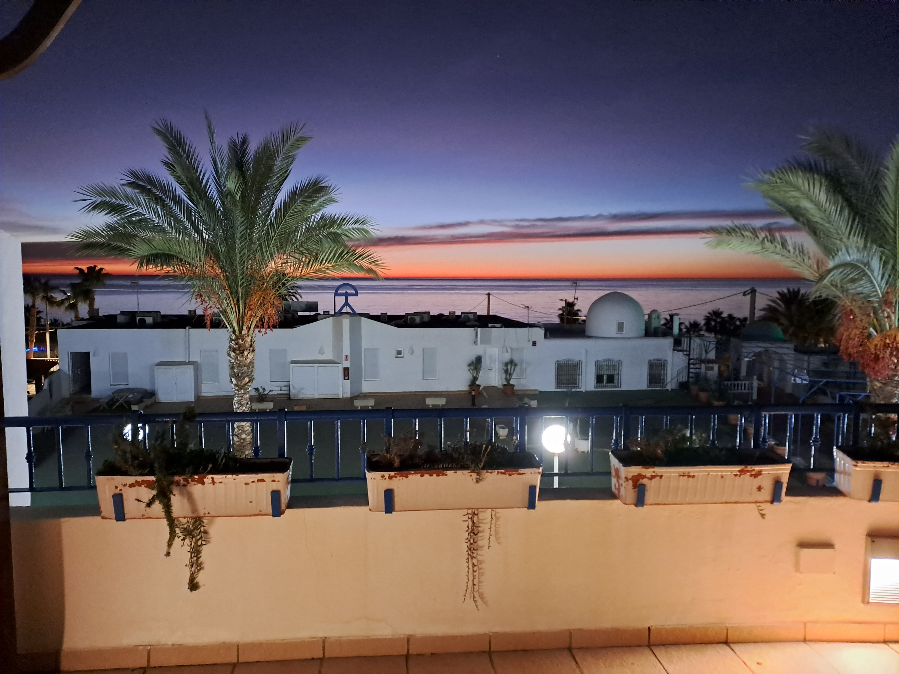
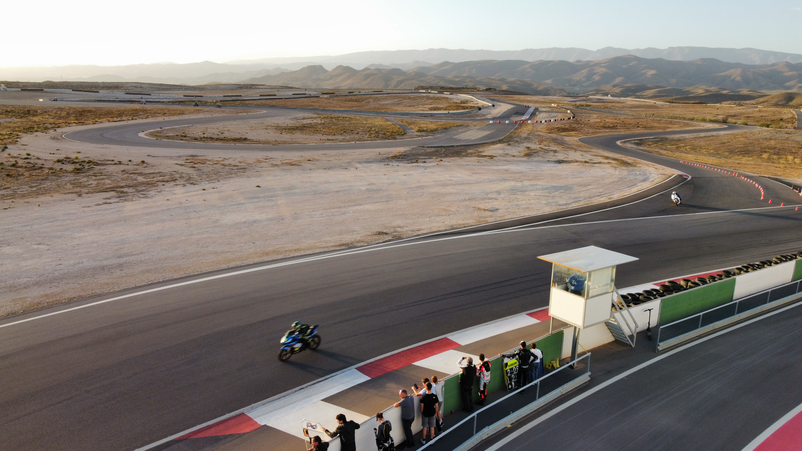
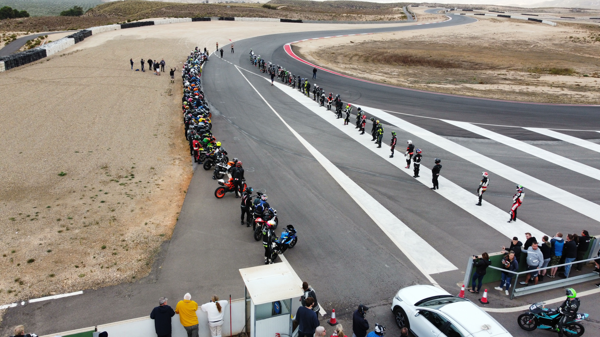

+++
date = '2025-07-20T17:31:11+01:00'
draft = false
title = '2025 Freetech Andalucia - 7th & 8th November'
showTableOfContents = true
+++

Hello World!!

Pink Triangle Racing is already looking ahead to the final round of the Freetech 2025 season.  As a bit of a blast of late-year warmth, the championship travels out to Spain for a weekend of sunshine, warmth and bike racing, just as the UK's transitioning into the winter season.  Want to come and spend a couple days messing about on motorbikes, then come along and join the team.

# Venue and Key Details
| Item | Notes |
|---------|----------|
| Date | Friday & Saturday 7th & 8th November 2025 |
| Venue | [Andalucia circuit](https://andaluciacircuit.com/) or [Almeria circuit](https://almeriacircuit.com/en/home-english/) (still to be announced)|
| Venue location |[Southern Spain](https://maps.app.goo.gl/pJCAX7tExksmqnhP9)  |
|Championship | [Freetech Endurance](https://www.freetechendurance.com/) |
|**Thursday 6th November**| Travel day.  Team members make their way to the hotel accommodation in Mojacar.|
| **Friday 7th November** ||
| Event Format | Test day and 2hr Endurance Race |
| Bike | KTM RC 125 |
| **Saturday 8th November**||
| Event Format | 8hr Endurance Race |
| Bike | KTM RC 125 |
| **Sunday 9th November**|Travel day.  Typically team members will return back to the UK on the Sunday, following Saturday's racing.  This gives a more relaxed home-bound journey. |
| Number of team riders | 3 riders per team|

Previous years have seen the championship racing on the Andalucia Circuit, and, though it's not yet confirmed, it's likely that the 2025 event will be on this (Andalucia) circuit, as opposed to the Almeria circuit.

# International Event Format:
Thursday -> Travel and unpack day.  
- With the bike arriving at the track on the Thursday, team members, if they can do so, are encouraged to make it to the track for the Thursday afternoon, to help un-pack and set up the garage spot, for the weekend ahead.  From there team members make their own way to the pre-arranged hotel in Mojacar.  Previous years have seen the championship booked into [Hotel Punta del Cantal](https://maps.app.goo.gl/hGzkqmLRsLrsLv9T9).  This season's hotel is yet to be announced, though it's likely to be in a similar location.

Friday -> Test day and 2hr Endurance Race.  
- Team members make their way to the track, for track and bike familiarisation for the majority of the day.  The last 2 hrs of the day will be the penultimate race of the season, being a 2hr endurance race.
- Then it's back to the hotel for some food, any drinks and sleep.

Saturday -> Endurance race day
- The Saturday is the highlight of the trip, with the 8hr endurance race.  Riders arrive at the track, perhaps a bit of a warm up to start the day, then the race runs from the morning, through until track closure.  
- Following the race, podium celebrations and debrief, it's pack-down and loading the bikes back ready for transportation back to the UK.  Riders are encouraged to help with the packing away, though travel depending, if journeys have to start promptly to catch flights home, riders are free to do so.  

# Rider Requirements
The international nature of the event makes it subtly different for the organisers, but mainly pretty much the same for riders...  

## Riders will need to:
- get in contact with Pink Triangle Racing to secure and confirm their spot in the team for the event.
- pay the Pink Triangle Racing entry fee upfront and by the given deadline.
- arrange their own transport to / from relevant airports, the hotel and track
  - sharing of hire cars for transfers to and from airports, along with getting between the hotel and track can be arranged between the team members is recommended where possible.
- ensure they have suitable travel insurance in place, which includes motorbike competition sports cover
  - Spanish state-provided healthcare does not cover injuries sustained during motorsport and as such personal travel insurance is mandatory, and the event organisers will not allow participation without evidence of suitable insurance cover.
- ensure they have the required riding kit.  
  - this can be transported with the bikes, and to do so, kit hand-overs will need to be arranged prior to bike shipping.
- ensure they have suitable travel documentation, i.e. passport, visas and so forth.

# Get Involved
If you're after a bit of sun before the UK winter bites in earnest, give us a shout.  Have a look through the [join us](join_us) page for further details about what you'll need, and feel free to get in [contact](contact) to get signed up.
