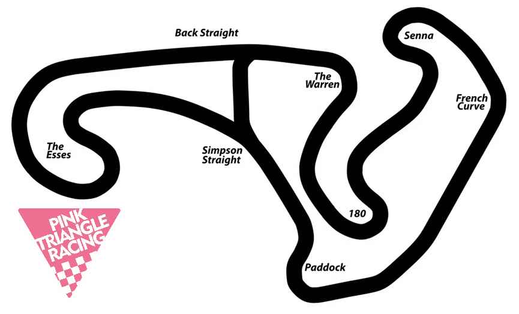

+++
date = '2025-07-09T20:44:05+01:00'
draft = false
title = '2025 Freetech Red Lodge - 8th & 9th August'
+++

Pink Triangle Racing is building a team to enter the upcoming Freetech 10hr endurance race at [Red Lodge Karting](https://www.redlodgekarting.com/).  This will be a tight technical endeavour, and as the first time the team will have raced at Red Lodge, it'll be a big learning curve throughout the weekend.  Riding into the dusk, needing headlights, is an experience not to be missed.

# Venue and Key Details
| Item | Notes |
|-----|----------|
| Date | Friday & Saturday 8th & 9th August 2025 |
| Venue | [Red Lodge Karting](https://www.redlodgekarting.com/) [Google Maps Link](https://maps.app.goo.gl/URgw2e9fMSt2WRWL9) |
| Venue Postcode | [IP28 8LE](https://www.redlodgekarting.com/contact)  |
|Championship | [Freetech Endurance](https://www.freetechendurance.com/) |
| **Friday 8th August** ||
| Event Format | Test day and 2hr Endruance Race |
| Bike | KTM RC 125 |
| **Saturday 9th August**||
| Event Format | 10hr Endurance Race |
| Bike | KTM RC 125 |
| Number of team riders | 3 riders|

# Get Involved
If a real endurance challenge is what you're after, this is a great change to get involved.  Have a look through the [join us](join_us) page for further details about what you'll need, and feel free to get in [contact](contact) to get signed up.

# Team logistics
The bike will likely be arriving at the venue during the evening of Thursday 7th July, with some team members camping at the track.  Riders will need to arrange their own accomodation for any nights they will be present.
