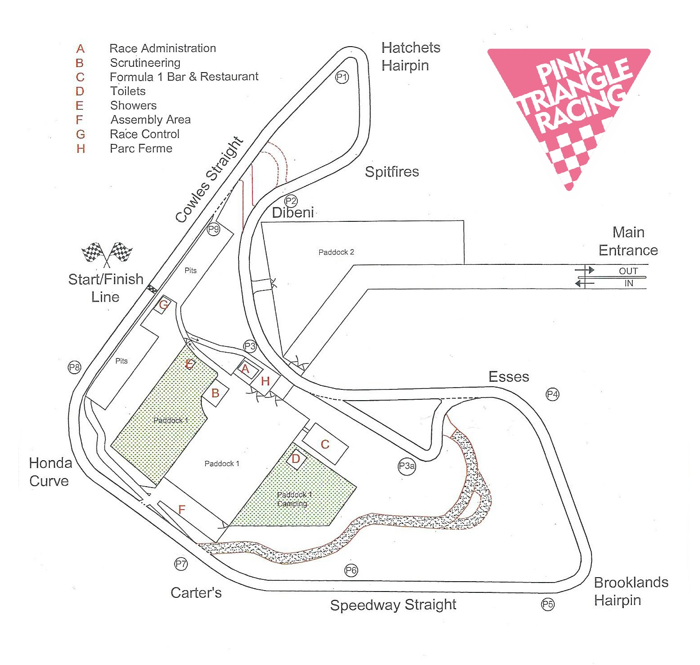

+++
date = '2025-06-28T09:45:50+01:00'
draft = true
title = '2025 MERS Rnd 3'
+++

Pink Triangle Racing will be entering a bike at the MERS 6hr race at Pembrey on August 9th 2025.  Event details below.

# Venue and Key Details

| Item | Notes |
|-----|----------|
| Date | Saturday August 9th 2025 |
| Venue | [Pembrey Race Circuit](https://pembreycircuit.co.uk/) |
| Venue Postcode | [SA16 0HZ](https://pembreycircuit.co.uk/find-us) |
|Championship | [MERS UK](https://www.mers-uk.co.uk/) |
|||
| Event Format | 6hr Endruance Race |
| Bike | KTM RC 390 |
| Number of team riders | 3 riders, giving 2hrs race time each|

# Notes
- As the MERS championship is registed with the ACU, each rider will need to have an ACU license.
- The team will be arriving on the Friday evening and stopping over night at the circuit so the team's all set up and ready for the Saturday's racing.  Come and join for the Friday night as well, if that suits.

# Rider Requirements
On top of the details in the "Rider Requirmeents" pages, each rider will need to have their own valid ACU race license to be able to compete in this event.
